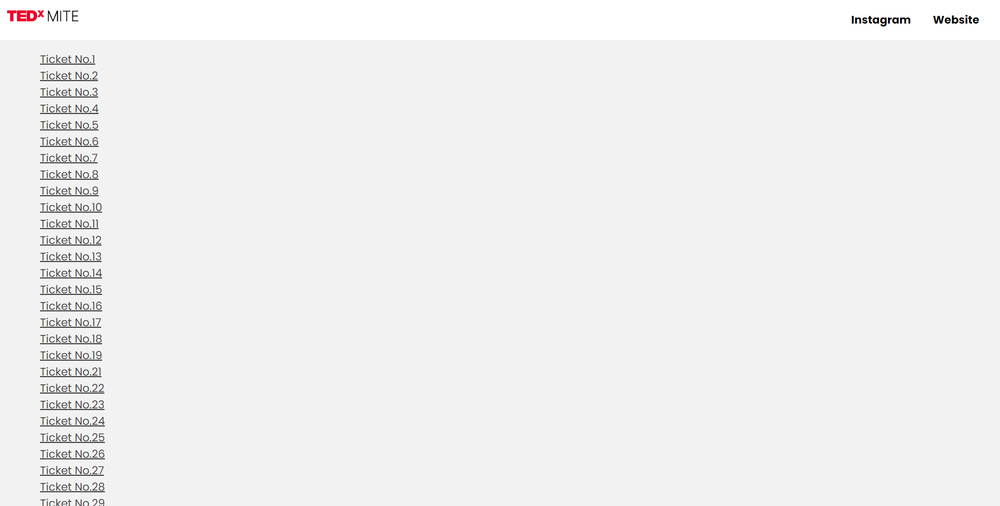
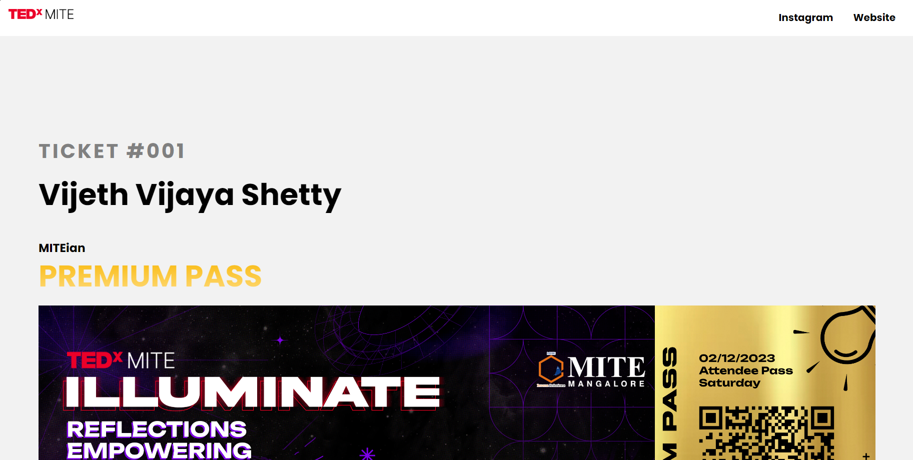
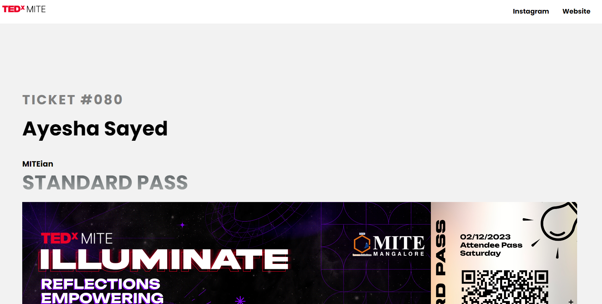
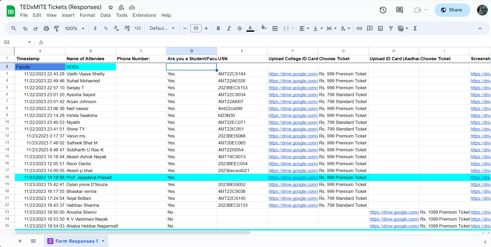
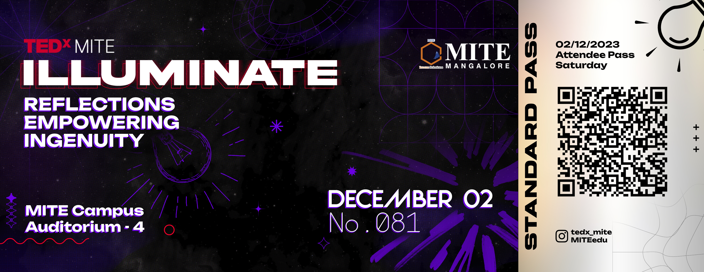

# TEDxMITE Ticket Portal

A web application built to use as a ticket portal for TEDxMITE 2023. It is built using NodeJS, ExpressJS and Handlebars.
The project is linked to a google sheet which is used as  a database.

The application works with the physical copies of the ticktes where each ticket has a unique qr code. Each qr code leads to the attendee details of that perticular ticket number

## How this application works

[1] Everytime a attendee enters/buys a tickets to TEDxMITE 2023 using this [form](https://docs.google.com/forms/d/e/1FAIpQLSeFrl6ZajiIh2safxh_5GZ3JiedvinZhWSFp931ifZ1xlHRhw/viewform) an entry is made to a google [sheet](https://docs.google.com/spreadsheets/d/1ejxDDZ2hHsj71ymw4PS7OYyDOhIKvPJcujQfBwYxiPw/edit?resourcekey#gid=847643383)

[2] Tickets are printed where each ticket contains a unique qr code. 

[3] The application is linked to the sheet using google cloud api.

[4] Manually entering the ticket numbers in the sheet links the qr code on the ticket with a perticular attendee entry

[5] For every ticket the application takes account of the type of ticket (Standard Pass/Premium Pass). Also checks if the attendee is a MITEian or not

## Screenshots

List of all the tickets that have been assigned



Example for someone who has bought a Premium Pass



Example for someone who has bought a Strandard Pass



Screenshot of the google sheet



## Scan the QR code to test the application
Pictures of printed tickets each with a unique qr code. 




## Run Locally

Clone the project

```bash
  git clone https://link-to-project
```

Go to the project directory

```bash
  cd my-project
```

Install dependencies

```bash
  npm install
```

Start the server

```bash
  npm start
```

